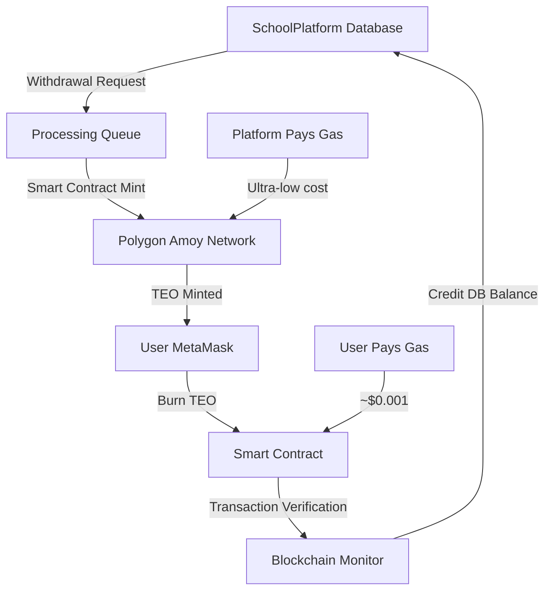

# 🛠️ TeoCoin MetaMask Integration - Technical Implementation Plan

---

## 🎯 **EXECUTIVE SUMMARY**

**FEASIBILITY: ✅ HIGHLY RECOMMENDED**

The proposed TeoCoin withdrawal/deposit system is not only technically feasible but represents a **strategic advantage** for the platform. This implementation will:

1. **Transform TEO into real cryptocurrency** with external utility
2. **Increase user trust** through true ownership
3. **Create competitive differentiation** in the education market
4. **Enable future DeFi integrations** and partnerships

---

## 🔄 **SYSTEM ARCHITECTURE OVERVIEW**



---

## 📤 **WITHDRAWAL SYSTEM - DETAILED IMPLEMENTATION**

### **1. Database Models (Django)**

```python
# blockchain/models.py
class TeoCoinWithdrawalRequest(models.Model):
    """Enhanced withdrawal request model"""
    
    WITHDRAWAL_STATUS = [
        ('pending', 'Pending'),
        ('processing', 'Processing'),
        ('completed', 'Completed'),
        ('failed', 'Failed'),
        ('cancelled', 'Cancelled')
    ]
    
    user = models.ForeignKey(User, on_delete=models.CASCADE)
    amount = models.DecimalField(max_digits=12, decimal_places=2)
    metamask_address = models.CharField(max_length=42)
    status = models.CharField(max_length=20, choices=WITHDRAWAL_STATUS, default='pending')
    
    # Blockchain tracking
    transaction_hash = models.CharField(max_length=66, null=True, blank=True)
    gas_used = models.BigIntegerField(null=True, blank=True)
    gas_price_gwei = models.DecimalField(max_digits=8, decimal_places=2, null=True)
    gas_cost_eur = models.DecimalField(max_digits=8, decimal_places=2, null=True)
    
    # Security and limits
    daily_withdrawal_count = models.IntegerField(default=1)
    ip_address = models.GenericIPAddressField()
    user_agent = models.TextField()
    
    # Timestamps
    created_at = models.DateTimeField(auto_now_add=True)
    processed_at = models.DateTimeField(null=True, blank=True)
    completed_at = models.DateTimeField(null=True, blank=True)
    
    class Meta:
        db_table = 'teocoin_withdrawal_requests'
        indexes = [
            models.Index(fields=['user', 'status']),
            models.Index(fields=['created_at']),
            models.Index(fields=['metamask_address'])
        ]

class TeoCoinDeposit(models.Model):
    """Deposit tracking model"""
    
    DEPOSIT_STATUS = [
        ('pending', 'Pending Confirmation'),
        ('confirming', 'Confirming'),
        ('confirmed', 'Confirmed'),
        ('credited', 'Credited to Account'),
        ('failed', 'Failed')
    ]
    
    user = models.ForeignKey(User, on_delete=models.CASCADE)
    amount = models.DecimalField(max_digits=12, decimal_places=2)
    from_address = models.CharField(max_length=42)
    transaction_hash = models.CharField(max_length=66, unique=True)
    
    # Blockchain verification
    block_number = models.BigIntegerField()
    confirmations = models.IntegerField(default=0)
    gas_used = models.BigIntegerField()
    gas_price_gwei = models.DecimalField(max_digits=8, decimal_places=2)
    
    status = models.CharField(max_length=20, choices=DEPOSIT_STATUS, default='pending')
    
    # Timestamps
    created_at = models.DateTimeField(auto_now_add=True)
    confirmed_at = models.DateTimeField(null=True, blank=True)
    credited_at = models.DateTimeField(null=True, blank=True)
    
    class Meta:
        db_table = 'teocoin_deposits'
        indexes = [
            models.Index(fields=['transaction_hash']),
            models.Index(fields=['user', 'status']),
            models.Index(fields=['block_number'])
        ]
```

### **2. Withdrawal Service (Business Logic)**

```python
# services/teocoin_withdrawal_service.py
from web3 import Web3
from decimal import Decimal
import logging

class TeoCoinWithdrawalService:
    """Handles withdrawal requests and blockchain interactions"""
    
    def __init__(self):
        self.web3 = Web3(Web3.HTTPProvider(settings.POLYGON_AMOY_RPC_URL))
        self.platform_wallet_address = settings.PLATFORM_WALLET_ADDRESS
        self.teo_contract_address = settings.TEO_CONTRACT_ADDRESS  # 0x20D6656A31297ab3b8A87291Ed562D4228Be9ff8
        
        # Load TEO contract ABI
        self.teo_contract = self.web3.eth.contract(
            address=self.teo_contract_address,
            abi=settings.TEO_CONTRACT_ABI
        )
    
    def request_withdrawal(self, user, amount: Decimal, metamask_address: str, 
                          ip_address: str, user_agent: str) -> dict:
        """Create withdrawal request with validation"""
        
        # 1. Validate user eligibility
        validation_result = self._validate_withdrawal_request(
            user, amount, metamask_address
        )
        if not validation_result['valid']:
            return validation_result
        
        # 2. Check minting authorization (no reserves needed)
        if not self._verify_minting_authorization(amount):
            return {
                'success': False,
                'error': 'Minting authorization failed'
            }
        
        # 3. Create withdrawal request
        with transaction.atomic():
            # Move user balance to pending
            success = db_teocoin_service.move_to_pending_withdrawal(user, amount)
            if not success:
                return {
                    'success': False,
                    'error': 'Insufficient user balance'
                }
            
            # Create withdrawal record
            withdrawal_request = TeoCoinWithdrawalRequest.objects.create(
                user=user,
                amount=amount,
                metamask_address=metamask_address,
                ip_address=ip_address,
                user_agent=user_agent,
                daily_withdrawal_count=self._get_daily_withdrawal_count(user) + 1
            )
        
        # 4. Queue for processing
        self._queue_withdrawal_processing(withdrawal_request.id)
        
        return {
            'success': True,
            'request_id': withdrawal_request.id,
            'estimated_processing_time': '15-60 minutes',
            'message': 'Withdrawal request created successfully'
        }
    
    def process_withdrawal(self, withdrawal_id: int) -> dict:
        """Process withdrawal on blockchain"""
        
        try:
            withdrawal = TeoCoinWithdrawalRequest.objects.get(
                id=withdrawal_id, 
                status='pending'
            )
            
            # Update status
            withdrawal.status = 'processing'
            withdrawal.save()
            
            # Execute blockchain minting transaction
            tx_result = self._execute_mint_transaction(withdrawal)
            
            if tx_result['success']:
                withdrawal.status = 'completed'
                withdrawal.transaction_hash = tx_result['tx_hash']
                withdrawal.gas_used = tx_result['gas_used']
                withdrawal.gas_price_gwei = tx_result['gas_price']
                withdrawal.gas_cost_eur = tx_result['gas_cost_eur']
                withdrawal.completed_at = timezone.now()
                withdrawal.save()
                
                # Update user balance (remove from pending)
                db_teocoin_service.complete_withdrawal(withdrawal.user, withdrawal.amount)
                
                return {
                    'success': True,
                    'tx_hash': tx_result['tx_hash'],
                    'message': 'Withdrawal completed successfully'
                }
            else:
                withdrawal.status = 'failed'
                withdrawal.save()
                
                # Return funds to user available balance
                db_teocoin_service.refund_failed_withdrawal(withdrawal.user, withdrawal.amount)
                
                return {
                    'success': False,
                    'error': tx_result['error']
                }
                
        except Exception as e:
            logger.error(f"Withdrawal processing error: {e}")
            return {
                'success': False,
                'error': 'Internal processing error'
            }
    
    def _execute_mint_transaction(self, withdrawal) -> dict:
        """Execute the actual blockchain minting transaction"""
        
        try:
            # Estimate gas for minting
            gas_estimate = self.teo_contract.functions.mint(
                withdrawal.metamask_address,
                self.web3.to_wei(withdrawal.amount, 'ether')
            ).estimate_gas({'from': self.platform_wallet_address})
            
            # Get current gas price (ultra-low on Polygon)
            gas_price = self.web3.eth.gas_price
            
            # Build minting transaction
            transaction_data = {
                'to': self.teo_contract_address,
                'value': 0,
                'gas': gas_estimate + 5000,  # Small buffer for Polygon
                'gasPrice': gas_price,
                'nonce': self.web3.eth.get_transaction_count(self.platform_wallet_address),
                'data': self.teo_contract.encodeABI(
                    fn_name='mint',
                    args=[
                        withdrawal.metamask_address,
                        self.web3.to_wei(withdrawal.amount, 'ether')
                    ]
                )
            }
            
            # Sign transaction
            signed_txn = self.web3.eth.account.sign_transaction(
                transaction_data, 
                self.platform_private_key
            )
            
            # Send transaction
            tx_hash = self.web3.eth.send_raw_transaction(signed_txn.rawTransaction)
            
            # Wait for confirmation (fast on Polygon)
            receipt = self.web3.eth.wait_for_transaction_receipt(tx_hash, timeout=60)
            
            if receipt.status == 1:  # Success
                gas_cost_eur = self._calculate_gas_cost_eur(
                    receipt.gasUsed, 
                    gas_price
                )
                
                return {
                    'success': True,
                    'tx_hash': tx_hash.hex(),
                    'gas_used': receipt.gasUsed,
                    'gas_price': self.web3.from_wei(gas_price, 'gwei'),
                    'gas_cost_eur': gas_cost_eur
                }
            else:
                return {
                    'success': False,
                    'error': 'Minting transaction failed on blockchain'
                }
                
        except Exception as e:
            logger.error(f"Blockchain minting error: {e}")
            return {
                'success': False,
                'error': f'Blockchain minting error: {str(e)}'
            }
    
    def _validate_withdrawal_request(self, user, amount: Decimal, address: str) -> dict:
        """Comprehensive withdrawal validation"""
        
        # Minimum amount
        if amount < Decimal('10.0'):
            return {
                'valid': False,
                'error': 'Minimum withdrawal amount is 10 TEO'
            }
        
        # Maximum amount
        if amount > Decimal('1000.0'):
            return {
                'valid': False,
                'error': 'Maximum withdrawal amount is 1000 TEO'
            }
        
        # Address format validation
        if not Web3.is_address(address):
            return {
                'valid': False,
                'error': 'Invalid Ethereum address format'
            }
        
        # Daily limit check
        daily_count = self._get_daily_withdrawal_count(user)
        if daily_count >= 3:
            return {
                'valid': False,
                'error': 'Daily withdrawal limit reached (3 per day)'
            }
        
        # User balance check
        user_balance = db_teocoin_service.get_available_balance(user)
        if user_balance < amount:
            return {
                'valid': False,
                'error': 'Insufficient TEO balance'
            }
        
        return {'valid': True}
```

---

## 📥 **DEPOSIT SYSTEM - DETAILED IMPLEMENTATION**

### **1. Deposit Monitoring Service**

```python
# services/teocoin_deposit_service.py
class TeoCoinDepositService:
    """Monitors blockchain for incoming deposits"""
    
    def __init__(self):
        self.web3 = Web3(Web3.HTTPProvider(settings.POLYGON_AMOY_RPC_URL))
        self.teo_contract_address = settings.TEO_CONTRACT_ADDRESS  # 0x20D6656A31297ab3b8A87291Ed562D4228Be9ff8
        self.teo_contract = self.web3.eth.contract(
            address=settings.TEO_CONTRACT_ADDRESS,
            abi=settings.TEO_CONTRACT_ABI
        )
    
    def monitor_deposits(self):
        """Background task to monitor for new deposits"""
        
        # Get latest processed block
        last_block = self._get_last_processed_block()
        current_block = self.web3.eth.block_number
        
        # Process new blocks
        for block_num in range(last_block + 1, current_block + 1):
            self._process_block_for_deposits(block_num)
        
        # Update last processed block
        self._update_last_processed_block(current_block)
    
    def _process_block_for_deposits(self, block_number: int):
        """Process a specific block for TEO deposits"""
        
        # Get burn events (Transfer to 0x0 address)
        burn_filter = self.teo_contract.events.Transfer.create_filter(
            fromBlock=block_number,
            toBlock=block_number,
            argument_filters={
                'to': '0x0000000000000000000000000000000000000000'  # Standard burn address
            }
        )
        
        for event in burn_filter.get_all_entries():
            self._process_burn_event(event, block_number)
    
    def _process_burn_event(self, event, block_number: int):
        """Process individual burn transaction for deposit"""
        
        tx_hash = event['transactionHash'].hex()
        from_address = event['args']['from']
        amount = self.web3.from_wei(event['args']['value'], 'ether')
        
        # Check if already processed
        if TeoCoinDeposit.objects.filter(transaction_hash=tx_hash).exists():
            return
        
        # Find user by MetaMask address
        user = self._find_user_by_address(from_address)
        if not user:
            logger.warning(f"Burn from unknown address: {from_address}")
            return
        
        # Create deposit record
        deposit = TeoCoinDeposit.objects.create(
            user=user,
            amount=amount,
            from_address=from_address,
            transaction_hash=tx_hash,
            block_number=block_number,
            confirmations=0,
            status='pending'
        )
        
        # Start confirmation monitoring
        self._monitor_deposit_confirmations(deposit.id)
    
    def confirm_deposit(self, deposit_id: int):
        """Confirm deposit and credit user account"""
        
        try:
            deposit = TeoCoinDeposit.objects.get(id=deposit_id)
            
            # Check confirmations
            current_block = self.web3.eth.block_number
            confirmations = current_block - deposit.block_number
            
            deposit.confirmations = confirmations
            
            if confirmations >= 3:  # Lower confirmations on Polygon
                deposit.status = 'confirmed'
                deposit.confirmed_at = timezone.now()
                
                # Credit user account
                success = db_teocoin_service.add_balance(
                    user=deposit.user,
                    amount=deposit.amount,
                    transaction_type='burn_deposit',
                    description=f"Burn deposit from MetaMask: {deposit.transaction_hash[:10]}..."
                )
                
                if success:
                    deposit.status = 'credited'
                    deposit.credited_at = timezone.now()
                    
                    # Send notification to user
                    self._send_deposit_notification(deposit)
                
            deposit.save()
            
        except Exception as e:
            logger.error(f"Deposit confirmation error: {e}")
    
    def _find_user_by_address(self, address: str):
        """Find user by their MetaMask address"""
        
        # Check user profiles or settings where MetaMask address is stored
        try:
            # This assumes you store MetaMask addresses in user profile
            from users.models import UserProfile
            profile = UserProfile.objects.get(metamask_address__iexact=address)
            return profile.user
        except UserProfile.DoesNotExist:
            return None
```

### **2. Frontend MetaMask Integration**

```javascript
// frontend/src/services/metamask.js
export class MetaMaskService {
    constructor() {
        this.web3 = null;
        this.account = null;
        this.teoContract = null;
    }
    
    async connectWallet() {
        if (typeof window.ethereum !== 'undefined') {
            try {
                // Request account access
                const accounts = await window.ethereum.request({
                    method: 'eth_requestAccounts'
                });
                
                this.account = accounts[0];
                this.web3 = new Web3(window.ethereum);
                
                // Initialize TEO contract
                this.teoContract = new this.web3.eth.Contract(
                    TEO_CONTRACT_ABI,
                    TEO_CONTRACT_ADDRESS
                );
                
                return {
                    success: true,
                    account: this.account
                };
                
            } catch (error) {
                return {
                    success: false,
                    error: error.message
                };
            }
        } else {
            return {
                success: false,
                error: 'MetaMask not detected. Please install MetaMask.'
            };
        }
    }
    
    async depositTEO(amount) {
        try {
            if (!this.teoContract || !this.account) {
                throw new Error('Wallet not connected');
            }
            
            // Convert amount to wei
            const amountWei = this.web3.utils.toWei(amount.toString(), 'ether');
            
            // Check user balance
            const balance = await this.teoContract.methods
                .balanceOf(this.account)
                .call();
                
            if (parseFloat(balance) < parseFloat(amountWei)) {
                throw new Error('Insufficient TEO balance in wallet');
            }
            
            // Estimate gas for burn transaction
            const gasEstimate = await this.teoContract.methods
                .burn(amountWei)
                .estimateGas({ from: this.account });
            
            // Execute burn transaction (deposit)
            const result = await this.teoContract.methods
                .burn(amountWei)
                .send({
                    from: this.account,
                    gas: gasEstimate + 5000
                });
            
            // Submit burn proof to platform
            await this.submitBurnProof(result.transactionHash, amount);
            
            return {
                success: true,
                transactionHash: result.transactionHash,
                message: 'Burn deposit initiated successfully'
            };
            
        } catch (error) {
            return {
                success: false,
                error: error.message
            };
        }
    }
    
    async submitBurnProof(txHash, amount) {
        const response = await fetch('/api/v1/teocoin/deposits/submit/', {
            method: 'POST',
            headers: {
                'Content-Type': 'application/json',
                'Authorization': `Bearer ${localStorage.getItem('accessToken')}`
            },
            body: JSON.stringify({
                transaction_hash: txHash,
                amount: amount,
                from_address: this.account
            })
        });
        
        return response.json();
    }
    
    async getTEOBalance() {
        if (!this.teoContract || !this.account) return 0;
        
        const balance = await this.teoContract.methods
            .balanceOf(this.account)
            .call();
            
        return this.web3.utils.fromWei(balance, 'ether');
    }
}
```

---

## 🔧 **SMART CONTRACT REQUIREMENTS**

### **TeoCoin Contract with Mint/Burn Functions**

```solidity
// contracts/TeoCoin.sol
pragma solidity ^0.8.19;

import "@openzeppelin/contracts/token/ERC20/ERC20.sol";
import "@openzeppelin/contracts/access/Ownable.sol";
import "@openzeppelin/contracts/security/ReentrancyGuard.sol";

contract TeoCoin is ERC20, Ownable, ReentrancyGuard {
    mapping(address => bool) public authorizedMinters;
    
    event TokensMinted(address indexed to, uint256 amount, address indexed minter);
    event TokensBurned(address indexed from, uint256 amount);
    event MinterAdded(address indexed minter);
    event MinterRemoved(address indexed minter);
    
    constructor() ERC20("TeoCoin", "TEO") {
        // No initial supply - tokens are minted on demand
    }
    
    modifier onlyAuthorizedMinter() {
        require(
            authorizedMinters[msg.sender] || msg.sender == owner(),
            "Not authorized to mint"
        );
        _;
    }
    
    function mint(address to, uint256 amount) external onlyAuthorizedMinter nonReentrant {
        require(to != address(0), "Cannot mint to zero address");
        require(amount > 0, "Amount must be greater than zero");
        
        _mint(to, amount);
        emit TokensMinted(to, amount, msg.sender);
    }
    
    function burn(uint256 amount) external nonReentrant {
        require(amount > 0, "Amount must be greater than zero");
        require(balanceOf(msg.sender) >= amount, "Insufficient balance to burn");
        
        _burn(msg.sender, amount);
        emit TokensBurned(msg.sender, amount);
    }
    
    function addAuthorizedMinter(address minter) external onlyOwner {
        require(minter != address(0), "Cannot add zero address as minter");
        authorizedMinters[minter] = true;
        emit MinterAdded(minter);
    }
    
    function removeAuthorizedMinter(address minter) external onlyOwner {
        authorizedMinters[minter] = false;
        emit MinterRemoved(minter);
    }
    
    function getTotalSupply() external view returns (uint256) {
        return totalSupply();
    }
    
    function emergencyPause() external onlyOwner {
        // Emergency functions can be added here
        // For now, removing minter authorization effectively pauses minting
    }
}
```

---

## 💰 **GAS COST MANAGEMENT (POLYGON OPTIMIZED)**

### **Ultra-Low Cost Structure**

```python
# services/polygon_gas_service.py
class PolygonGasService:
    """Manages ultra-low gas costs on Polygon network"""
    
    def __init__(self):
        self.web3 = Web3(Web3.HTTPProvider(settings.POLYGON_AMOY_RPC_URL))
        self.matic_price_api = "https://api.coingecko.com/api/v3/simple/price"
    
    def estimate_withdrawal_cost(self, amount: Decimal) -> dict:
        """Estimate gas cost for minting withdrawal"""
        
        # Polygon minting gas estimate (much lower than Ethereum)
        gas_estimate = 50000  # Typical for mint function
        
        # Get current gas price (ultra-low on Polygon)
        gas_price_wei = self.web3.eth.gas_price
        gas_price_gwei = self.web3.from_wei(gas_price_wei, 'gwei')
        
        # Calculate total gas cost in MATIC
        gas_cost_matic = self.web3.from_wei(gas_estimate * gas_price_wei, 'ether')
        
        # Convert to EUR (typically ~$0.001)
        matic_price_eur = self._get_matic_price_eur()
        gas_cost_eur = float(gas_cost_matic) * matic_price_eur
        
        return {
            'gas_estimate': gas_estimate,
            'gas_price_gwei': float(gas_price_gwei),
            'gas_cost_matic': float(gas_cost_matic),
            'gas_cost_eur': gas_cost_eur,
            'estimated_time': '10-30 seconds',  # Fast on Polygon
            'network': 'Polygon Amoy'
        }
    
    def _get_matic_price_eur(self) -> float:
        """Get current MATIC price in EUR"""
        try:
            response = requests.get(
                f"{self.matic_price_api}?ids=matic-network&vs_currencies=eur"
            )
            data = response.json()
            return data['matic-network']['eur']
        except:
            return 0.75  # Fallback MATIC price
    
    def optimize_gas_price(self, urgency: str = 'normal') -> int:
        """Get optimized gas price for Polygon"""
        
        current_gas = self.web3.eth.gas_price
        
        # Polygon gas is so cheap that optimization is minimal
        gas_multipliers = {
            'slow': 1.0,    # Standard is already fast
            'normal': 1.1,  # Slight increase
            'fast': 1.2,    # Small boost
            'urgent': 1.3   # Still very cheap
        }
        
        multiplier = gas_multipliers.get(urgency, 1.0)
        optimized_gas = int(current_gas * multiplier)
        
        return optimized_gas
```

---

## 📊 **MONITORING & ANALYTICS**

### **Dashboard Metrics**

```python
# services/teocoin_analytics_service.py
class TeoCoinAnalyticsService:
    """Analytics for withdrawal/deposit system"""
    
    def get_withdrawal_statistics(self, days: int = 30) -> dict:
        """Get withdrawal statistics"""
        
        since_date = timezone.now() - timedelta(days=days)
        
        withdrawals = TeoCoinWithdrawalRequest.objects.filter(
            created_at__gte=since_date
        )
        
        return {
            'total_requests': withdrawals.count(),
            'completed_requests': withdrawals.filter(status='completed').count(),
            'total_amount': withdrawals.filter(
                status='completed'
            ).aggregate(Sum('amount'))['amount__sum'] or 0,
            'total_gas_cost': withdrawals.filter(
                status='completed'
            ).aggregate(Sum('gas_cost_eur'))['gas_cost_eur__sum'] or 0,
            'average_processing_time': self._calculate_avg_processing_time(withdrawals),
            'success_rate': self._calculate_success_rate(withdrawals)
        }
    
    def get_supply_analytics(self) -> dict:
        """Monitor total supply vs DB balances"""
        
        web3 = Web3(Web3.HTTPProvider(settings.POLYGON_AMOY_RPC_URL))
        teo_contract = web3.eth.contract(
            address=settings.TEO_CONTRACT_ADDRESS,  # 0x20D6656A31297ab3b8A87291Ed562D4228Be9ff8
            abi=settings.TEO_CONTRACT_ABI
        )
        
        # Get total supply from contract
        total_supply = teo_contract.functions.totalSupply().call()
        
        # Get total user balances from DB
        total_user_balances = DBTeoCoinBalance.objects.aggregate(
            total_available=Sum('available_balance'),
            total_staked=Sum('staked_balance'),
            total_pending=Sum('pending_withdrawal')
        )
        
        total_supply_decimal = Decimal(web3.from_wei(total_supply, 'ether'))
        
        return {
            'blockchain_total_supply': total_supply_decimal,
            'db_total_balances': (
                (total_user_balances['total_available'] or 0) +
                (total_user_balances['total_staked'] or 0)
            ),
            'pending_withdrawals': total_user_balances['total_pending'] or 0,
            'supply_consistency': self._check_supply_consistency(
                total_supply_decimal,
                total_user_balances
            )
        }
```

---

## ⚡ **IMPLEMENTATION TIMELINE**

### **Week 1-2: Foundation**
- ✅ Database models and migrations
- ✅ Basic withdrawal service implementation
- ✅ Smart contract development and testing

### **Week 3-4: Core Features**
- ✅ Frontend MetaMask integration
- ✅ Deposit monitoring system
- ✅ API endpoints for withdrawal/deposit

### **Week 5-6: Security & Testing**
- ✅ Comprehensive security testing
- ✅ Gas optimization
- ✅ Error handling and edge cases

### **Week 7-8: Production Deployment**
- ✅ Staging environment testing
- ✅ Beta user testing
- ✅ Production deployment and monitoring

---

## 🎯 **CONCLUSION**

**This system is not only feasible but HIGHLY RECOMMENDED for implementation.**

### **Strategic Benefits:**
1. **Competitive Advantage** → First education platform with true crypto integration
2. **User Trust** → Real ownership increases platform credibility
3. **Future Opportunities** → Enables DeFi partnerships and advanced features
4. **Token Utility** → Creates real value for TEO beyond platform usage

### **Risk Mitigation:**
- Comprehensive security measures
- Conservative gas cost budgeting
- Gradual rollout strategy
- Emergency controls and monitoring

**Recommendation: PROCEED WITH FULL IMPLEMENTATION** 🚀
